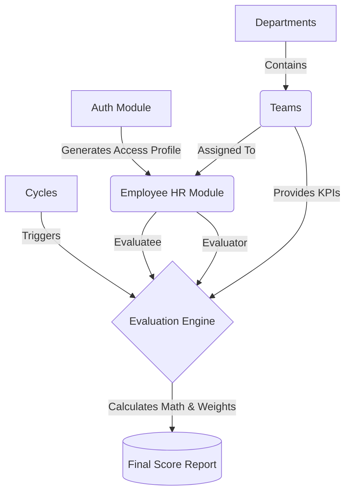

# 🚀 Performance Evaluation SaaS Backend


A modular, enterprise-grade **Performance Evaluation Backend** built with **FastAPI** and **Python**.
This system manages complex organizational hierarchies, passwordless OTP authentication, and dynamic KPI-based performance scoring engines.

---

# 🏗️ Architecture & System Flow

This project abandons traditional monolithic backend design in favor of a strictly **Domain-Driven Modular Architecture**. Identity Management (**Auth**) and HR Management (**Employees**) are completely decoupled, ensuring high scalability and clear separation of concerns.

## System Workflow



---

# 🗄️ Storage Engine: DB-Agnostic Design

Currently, the system uses a **custom JSON-based Storage engine** acting as an in-memory database.

### Advantages

* Persistent state during testing
* Zero external dependencies
* Simple debugging and local development

### Scalability

Because business logic is strictly separated from the storage layer, the backend can be migrated to:

* MongoDB
* PostgreSQL
* MySQL

without rewriting a single line of core business logic.

---

# 📂 Module Tree

The codebase is strictly organized by **business domain**.

```plaintext
app/
├── core/                  # System configs & abstract storage layer
├── utils/                 # Unified sequential ID generators
└── modules/
    ├── auth/              # Passwordless OTP & Access Profiles
    ├── departments/       # Org root & soft-deletion
    ├── teams/             # Composite uniqueness handling
    ├── employees/         # Cross-module HR linking
    ├── cycles/            # Workflow timelines (Draft -> Active)
    ├── evaluators/        # Complex Assignment Matrices
    ├── kpis/              # Weighted team metrics
    └── evaluations/       # The Final Mathematical Scoring Engine
```

---

# 📦 Core Modules in Detail

## 1️⃣ Identity & Access (Auth)

Handles user authentication and system access.

**Features**

* Passwordless OTP Login
* Eliminates password fatigue and credential stuffing
* Smart role assignment using **Pydantic validators**

Supported roles include:

* Admin
* Evaluator
* Employee

---

## 2️⃣ Organizational Structure (Departments & Teams)

### Departments

Top-level organizational structure.

Features:

* Soft-deletion protocol
* Historical record preservation

### Teams

Teams enforce **composite uniqueness**.

Example:

A team named **"QA"** can exist in multiple departments.

Example structure:

* Engineering → QA
* Mobile Dev → QA

---

## 3️⃣ HR Placement (Employees)

The **bridge module** between authentication and organization structure.

Responsibilities:

* Map **Auth Profiles** to **Departments**
* Assign employees to **Teams**
* Allow a single email to hold **multiple organizational roles**

---

## 4️⃣ The Evaluation Engine

This is the **core scoring system**.

Modules involved:

* Cycles
* Evaluators
* KPIs
* Evaluations

### Cycles

Controls evaluation timelines.

Lifecycle:

```
Draft → Active → Completed
```

Rules:

* Scores cannot be modified in completed cycles
* Enforces chronological workflow integrity

---

### Evaluator Assignments

Defines **who evaluates whom**.

Features:

* Prevents self-evaluations
* Supports weighted evaluation roles

Example:

```
Line Manager → 20 points
Peer → 10 points
Self Evaluation → 5 points
```

---

### KPIs

Configures **team-specific performance metrics**.

Features:

* Fractional weights
* Normalized scoring distribution
* Flexible KPI definitions per team

---

### Evaluations

The **final scoring engine**.

Responsibilities:

* Collect evaluator scores
* Apply KPI weights
* Calculate normalized performance grades
* Produce final evaluation reports

---

# 🛠️ Tech Stack

| Layer           | Technology                         |
| --------------- | ---------------------------------- |
| Framework       | FastAPI                            |
| Data Validation | Pydantic v2                        |
| Server          | Uvicorn                            |
| Language        | Python 3.10+                       |
| Storage         | DB-Agnostic JSON Temporary Storage |

---

# 🚀 Quick Start

## 1️⃣ Clone the Repository

```bash
git clone https://github.com/yourusername/performance-evaluation-backend.git
cd performance-evaluation-backend
```

---

## 2️⃣ Setup Virtual Environment

```bash
python -m venv .venv
```

Activate environment:

**Linux / Mac**

```bash
source .venv/bin/activate
```

**Windows**

```bash
.venv\Scripts\activate
```

---

## 3️⃣ Install Dependencies

```bash
pip install -r requirements.txt
```

---

## 4️⃣ Setup Environment Variables

```bash
cp .env.example .env
```

Edit `.env` with your local configurations.

---

## 5️⃣ Run the API Server

```bash
uvicorn app.main:app --reload
```

Server:

```
http://127.0.0.1:8000
```

Swagger API Documentation:

```
http://127.0.0.1:8000/docs
```

---

# 🧪 Interactive CLI Simulators

To allow rapid backend state testing **without building a frontend UI**, each module includes an **interactive CLI simulator**.

⚠️ Always run commands **from the project root directory.**

---

## Identity & Organization Setup

```bash
python -m app.modules.auth.test
python -m app.modules.departments.test
python -m app.modules.teams.test
python -m app.modules.employees.test
```

---

## Evaluation Engine

```bash
python -m app.modules.cycles.test
python -m app.modules.evaluators.test
python -m app.modules.kpis.test
python -m app.modules.evaluations.test
```

---

# 🔒 Engineering Best Practices Highlight

### Smart Validation

Uses **Pydantic `@model_validator`** to catch business-logic errors at the data ingestion layer.

Example:

* Prevent KPI weights exceeding **100%**
* Prevent self-evaluations
* Validate role permissions

---

### Soft Deletion Protocol

HR and evaluation records are **never permanently deleted**.

Instead:

```
is_active = False
```

This guarantees:

* Historical audit integrity
* Data traceability

---

### Unified ID Generation

Random UUIDs are replaced with **human-readable sequential IDs**.

Examples:

```
EMP-01
EMP-02
CYC-01
CYC-02
```

Benefits:

* Easier debugging
* Cleaner admin dashboards
* Better usability

---

### RESTful Integrity

API endpoints return **strictly typed payloads** mapped directly to domain models.

---

# 📌 Project Note

Developed as a **proprietary SaaS backend system** designed for scalable performance evaluation platforms.
"# performance-evaluation-appinsnap-django" 
